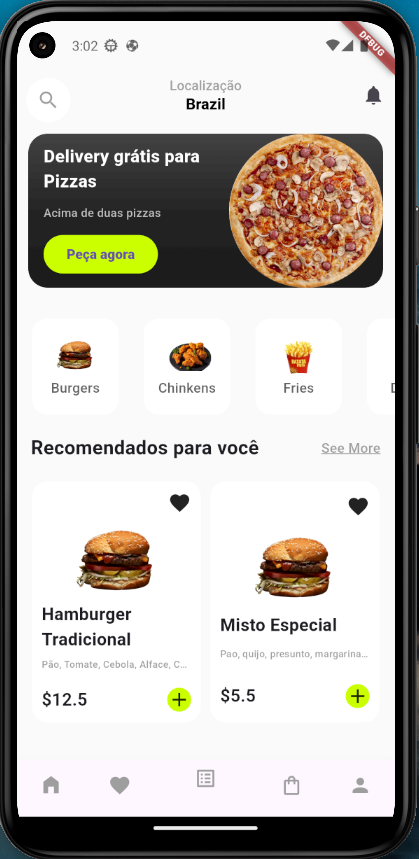
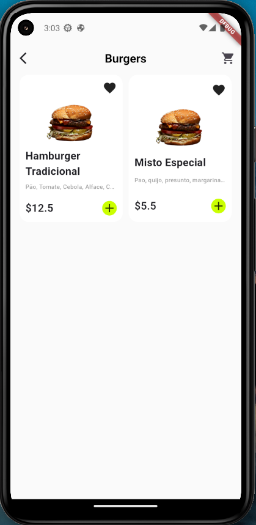
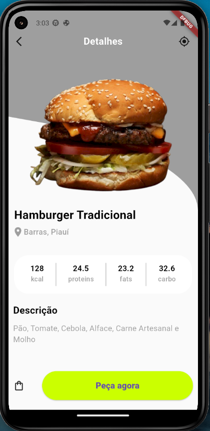

# cardapioapp

Estive desenvolvendo um app para estudar alguns conceitos e coloca-los em prática, o app é simples o intuito é que ele seja um cardapio online. Para a implementação do mesmo foi utilzado:

- Banco de dados local (SQFLite);
- Gerenciamento de estado (Provider);
- Arquitetura recomendada (MVVM);
- Singleton;

A seguir está o resultado da interface.

## Home Screen

## Lista de Itens Screen

## Detalhes Screen
